# ⚖️ LegalBot: Local AI-Powered Contract Intelligence Platform

[](https://www.docker.com/)
[](https://fastapi.tiangolo.com/)
[](https://react.dev/)
[](https://github.com/pgvector/pgvector)
[](https://huggingface.co/ibm-granite/granite-4.2-3b-GGUF)
[](LICENSE)

> **Enterprise-grade, privacy-first legal contract analysis platform.**  
> Processes confidential legal documents completely **offline on local infrastructure** using **IBM Granite 4.2 3B GGUF** via `llama.cpp` and **pgvector**. No external API calls, no third-party data leaks.

---

## 📚 Complete Project Documentation

Detailed documentation and guides are organized under the [`docs/`](file:///c:/Users/DEEPANSHU/Desktop/workspace/legalbot/docs) directory:

- 🏗️ **[System Architecture & Technical Design](file:///c:/Users/DEEPANSHU/Desktop/workspace/legalbot/docs/ARCHITECTURE.md)**: Deep dive into topology, microservices, NLP pipeline, database schema, and AES-256 security.
- 🚀 **[Deployment & Setup Guide](file:///c:/Users/DEEPANSHU/Desktop/workspace/legalbot/docs/DEPLOYMENT.md)**: Step-by-step instructions for running Docker Compose, SSL setup, and environment variables.
- 💡 **[User Guide & Feature Manual](file:///c:/Users/DEEPANSHU/Desktop/workspace/legalbot/docs/USER_GUIDE.md)**: Comprehensive walkthrough of contract uploading, side-by-side page reader, multi-select clause highlighting, and the Admin Panel.
- 📡 **[REST API Reference](file:///c:/Users/DEEPANSHU/Desktop/workspace/legalbot/docs/API_REFERENCE.md)**: Endpoint documentation for `/auth`, `/docs`, `/reports`, `/admin`, and `/tests`.

---

## ✨ Key Features

| Feature | Description |
| :--- | :--- |
| **🔒 100% Local & Privacy-First** | All model inferences run internally via `llama.cpp`. Documents are encrypted at rest with **AES-256-GCM**. |
| **📖 Side-by-Side Page Reader** | Interactive split view featuring page-wise navigation, section dividers, text search, and page risk counters. |
| **🎯 Multi-Select Risk Highlighting** | Select multiple risk clauses from the right panel to highlight corresponding document sections on the left panel. |
| **✨ AI Action Recommendations** | Concurrent LLM inference (`asyncio.gather`) generates direct, actionable negotiation and protective advice per risk. |
| **🔎 NLP Entity Extraction** | Automatically extracts Parties, Effective Dates, Jurisdiction, Governing Law, and Monetary Amounts via spaCy. |
| **⚙️ Admin Control Panel** | Dynamic risk rules CRUD editor, system KPI analytics, and user role management (`User` vs `Admin`). |
| **🖨️ Export & Print** | One-click export of structured executive summaries, risk breakdowns, and legal recommendations to PDF. |

---

## 📸 Visual Walkthrough: User & Admin Workflows

LegalBot provides tailored interfaces for everyday legal reviewers as well as organization administrators. Below is an end-to-end visual walkthrough of both user experiences.

---

### 👤 1. User Workflow: Contract Upload & Interactive Risk Analysis

Standard users can securely ingest contracts, monitor local AI processing, navigate document pages, and review clause-level risk recommendations with side-by-side highlighting.

#### Step 1: Secure Contract Upload
Upload agreements (`.pdf`, `.docx` up to 50 MB) via an intuitive drag-and-drop modal. Uploaded files are immediately encrypted at rest using AES-256-GCM.

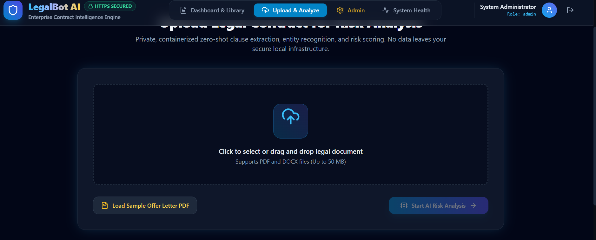

#### Step 2: Real-Time Local AI Processing
A progress indicator monitors the multi-stage local pipeline (PyMuPDF / docx extraction -> spaCy NER entity detection -> deterministic rule matching -> IBM Granite 3B LLM parallel inference).

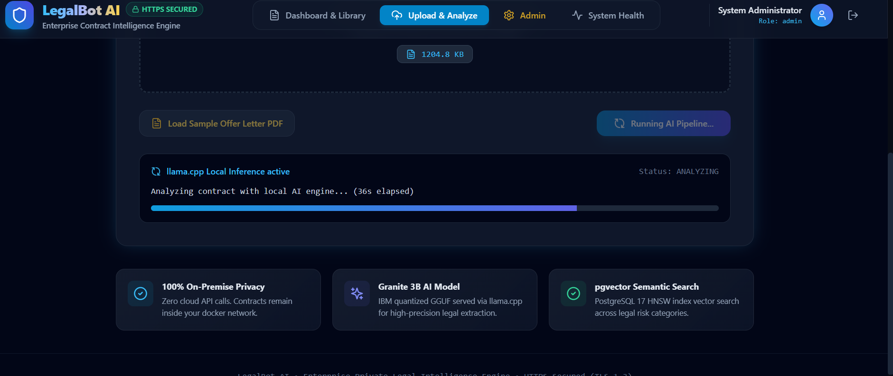

#### Step 3: Ingestion Confirmation & Document Repository
Once processed, contracts are stored with analysis metadata. Users can view their full contract catalog, complete with risk severity tags and date timestamps.

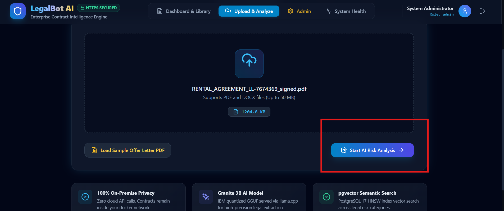

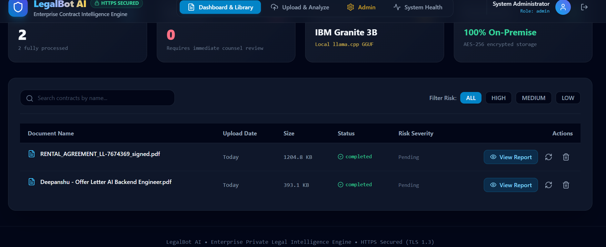

#### Step 4: Executive Summary & Categorized Risk Breakdown
The right-hand analysis panel provides key contract metadata (Parties, Jurisdiction, Effective Date), risk distributions, and expandable risk cards categorized into High, Medium, and Low severity.

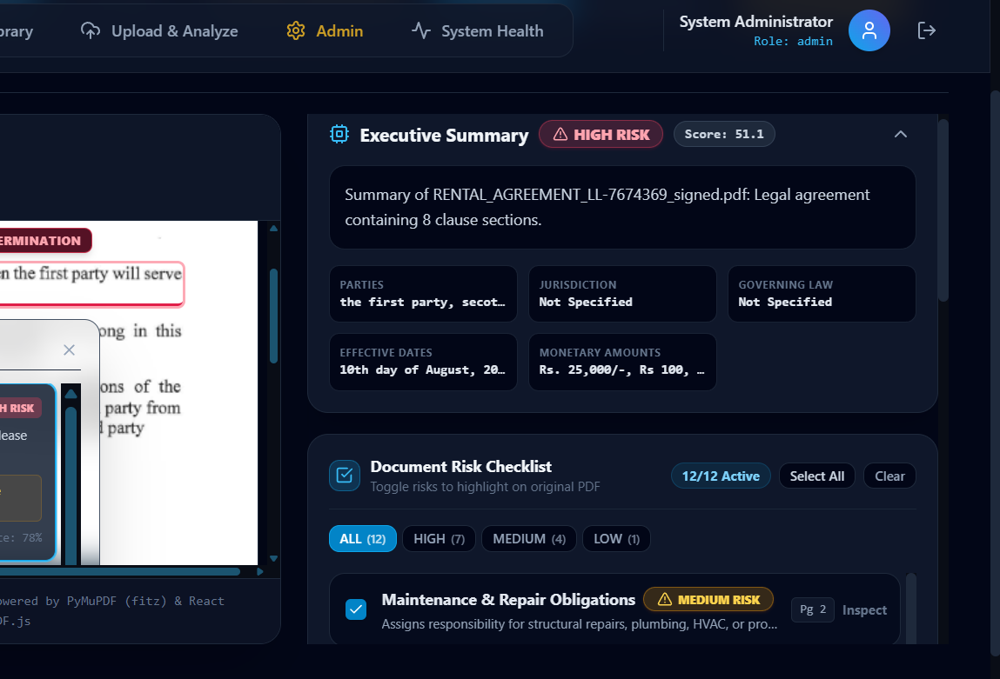

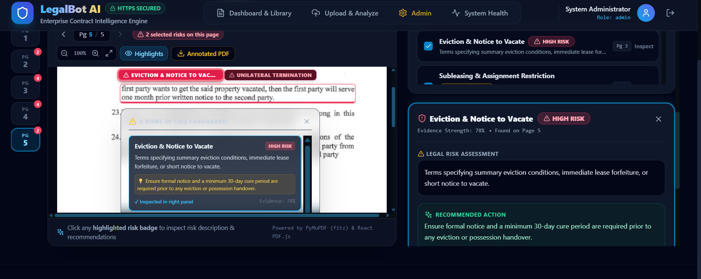

#### Step 5: Side-by-Side Interactive Reader & Multi-Select Highlighting
Review original text with page-by-page navigation (`Pg 1`, `Pg 2` with risk count badges) and section dividers. Clicking any risk card pins the clause and highlights matching document sections on the left panel with color-coded risk borders.

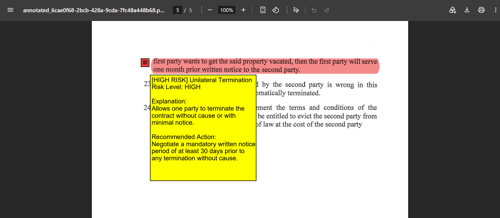

#### Step 6: Actionable Recommendations & Evidence Strength
Inspect individual clauses to view dual-AI confidence metrics (regex pattern + zero-shot LLM validation) and AI-generated negotiation recommendations for counter-drafting.

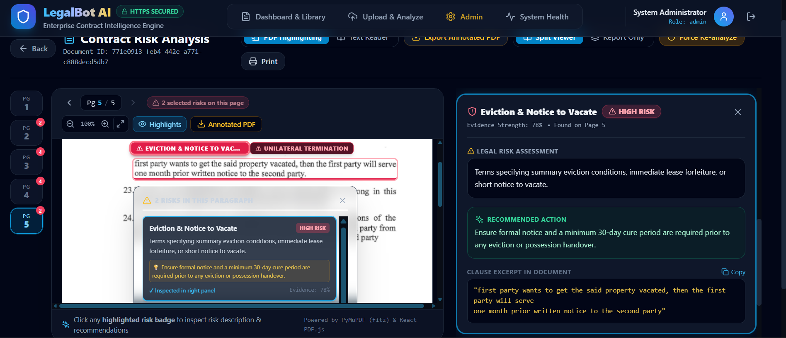

---

### 🛡️ 2. Administrator Workflow: Governance, Dynamic Rules & User Management

Administrators (`admin@legalbot.com`) have full access to system-wide analytics, live rule customization, rule simulation, document re-analysis queues, and user management.

#### Step 1: Analytics & KPI Dashboard
Get real-time visibility into organization-wide metrics: total analyzed contracts, high-risk flags, active risk classification rules, and pipeline throughput.

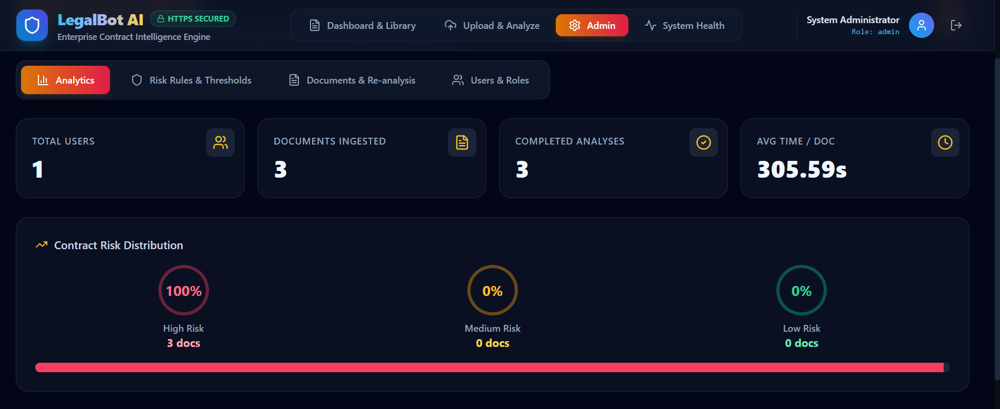

#### Step 2: Custom Risk Rule Creation
Create custom risk categories (e.g., *Data Protection / GDPR*, *Non-Solicitation*, *IP Assignment*) with custom severity levels, confidence thresholds, and keyword triggers without code deployment.

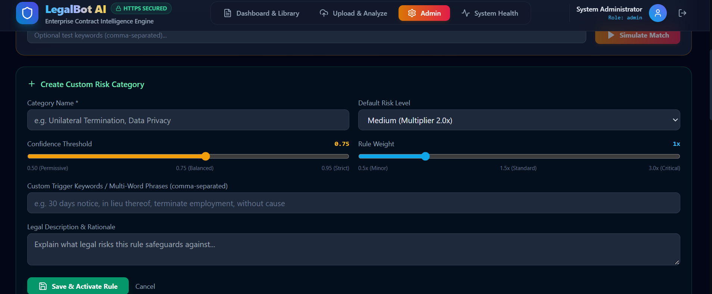

#### Step 3: Live Rule Simulation & Clause Matching
Test and calibrate rule sensitivity before saving. The built-in chunk tester simulates rule execution against sample clauses in real time.

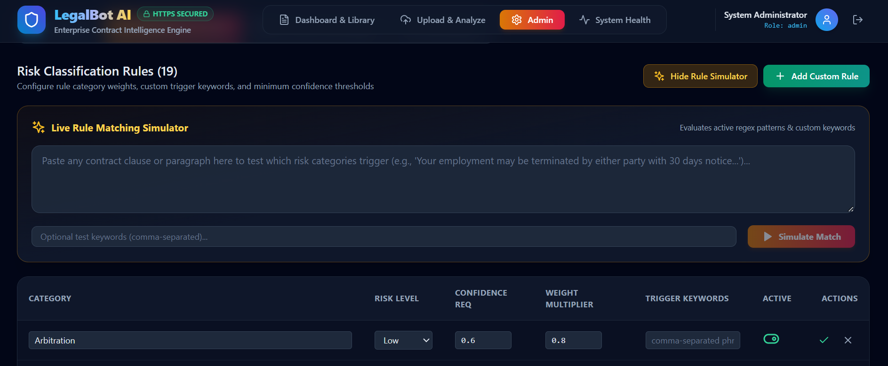

#### Step 4: Batch Document Re-Analysis
When legal policies or risk rules are updated, trigger single or sequential batch re-analysis across the document repository. Jobs run in a managed background queue to prevent local GPU/CPU overload.

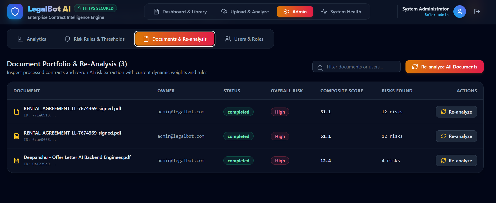

#### Step 5: Role-Based User Management
View all registered accounts, promote users to Administrator, demote privileges, or disable access with instant role synchronization.

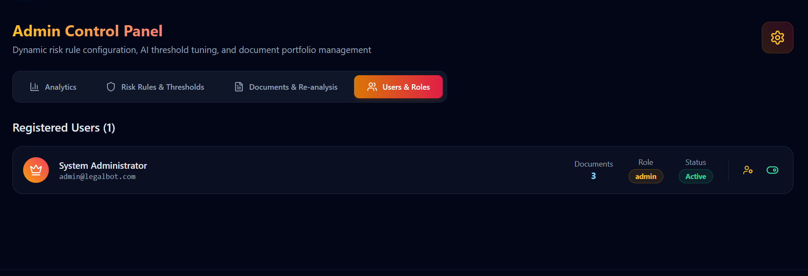

---

## 📐 Architecture Overview

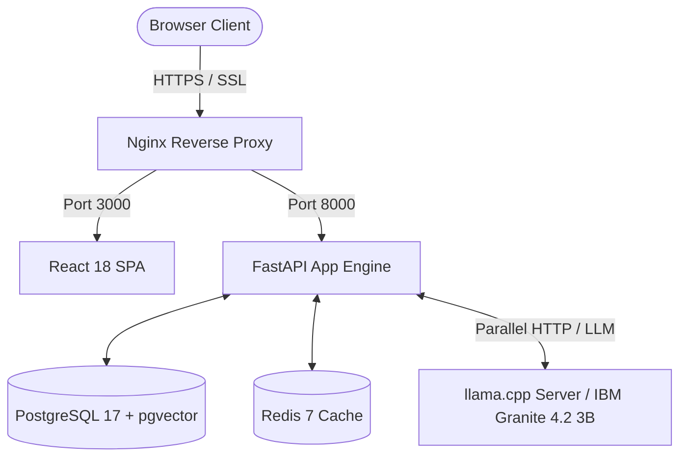

---

## ⚡ Quickstart Guide (3 Minutes)

### 1. Prerequisites
- [Docker Desktop](https://www.docker.com/products/docker-desktop/) or Docker Engine + Docker Compose v2+ installed & running.
- **Model File**: IBM Granite 4.2 3B Instruct GGUF (`granite-4.2-3b-Q4_K_M.gguf`, ~2.1 GB). Pre-downloading directly via `wget` or `curl` into `./models/` is strongly recommended for GitHub Codespaces or cloud environments.

### 2. Clone, Download Model & Launch
```bash
# 1. Clone repository
git clone https://github.com/your-org/legalbot.git
cd legalbot

# 2. Setup environment variables
cp .env.example .env

# 3. Download the LLM Model (Required for Codespaces / Reliable Egress)
mkdir -p models
wget -c "https://huggingface.co/ibm-granite/granite-4.2-3b-GGUF/resolve/main/granite-4.2-3b-Q4_K_M.gguf?download=true" -O models/granite-4.2-3b-Q4_K_M.gguf

# Alternative using curl:
# curl -C - -L "https://huggingface.co/ibm-granite/granite-4.2-3b-GGUF/resolve/main/granite-4.2-3b-Q4_K_M.gguf?download=true" -o models/granite-4.2-3b-Q4_K_M.gguf

# 4. Launch full stack with Docker Compose
docker compose up -d --build
```

> [!TIP]
> **Corrupted / Truncated Model Fix**: If you ever see `tensor 'blk.32.ffn_down.weight' data is not within the file bounds, model is corrupted or incomplete`, it indicates the model file was cut off mid-download (expected full size: ~2.1 GB / `2,244,011,552` bytes). Delete the incomplete file (`rm -f models/granite-4.2-3b-Q4_K_M.gguf`) and re-run the `wget -c` command above.

### 3. Open in Browser
Navigate to **[https://localhost](https://localhost)** in your web browser.

> [!NOTE]
> Because Nginx generates a local self-signed TLS certificate, click **Advanced** -> **Proceed to localhost (unsafe)** when prompted by your browser.

---

## 🔑 Default Administrator Credentials

Use these credentials to log in with full Admin Panel privileges:

- **Email**: `admin@legalbot.com`
- **Password**: `password123`

---

## 🛠️ Technology Stack

- **Frontend**: React 18, Vite, Tailwind CSS, Lucide Icons, Axios
- **Backend Engine**: Python 3.11, FastAPI, SQLAlchemy (Async), Pydantic v2, PyMuPDF, python-docx, spaCy
- **Database & Cache**: PostgreSQL 17 + `pgvector` (HNSW indexing), Redis 7 (AioRedis)
- **Local AI Inference**: `llama.cpp` server hosting IBM Granite 4.2 3B Instruct (GGUF Q4_K_M)
- **Reverse Proxy & Security**: Nginx (SSL/TLS termination, HTTP/2, client limits), Bcrypt, OAuth2 JWT

---

## 🧪 Running Diagnostic Verification Suite

To verify that all 6 microservices (PostgreSQL, Redis, llama.cpp, Backend, Nginx, Frontend) are fully operational:

```bash
# Run integration test suite
python backend/tests/test_api.py
```

---

## 📄 License

Distributed under the MIT License. See `LICENSE` for more information.
