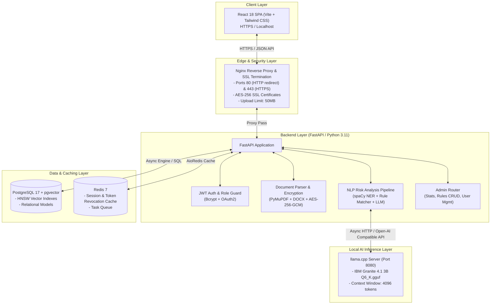

# 🏗️ LegalBot System Architecture & Technical Design

LegalBot is an enterprise-grade, privacy-first **Contract Intelligence and Risk Analysis Platform**. It runs completely on local infrastructure, utilizing local LLM inference (IBM Granite 4.1 3B GGUF via `llama.cpp`) to ensure **zero sensitive legal document leakage** to cloud APIs.

---

## 📐 System Topology & Component Diagram

---

## 🔬 Core System Components

### 1. Nginx Reverse Proxy (`legalbot_proxy`)
- **Port Binding**: Maps external `80` and `443` to internal container networks.
- **SSL Termination**: Self-signed or custom TLS/SSL certificate handling.
- **Routing Rules**:
  - `/` $\rightarrow$ React SPA (`legalbot_frontend:3000`)
  - `/auth/*`, `/docs/*`, `/reports/*`, `/admin/*`, `/tests/*` $\rightarrow$ FastAPI Backend (`legalbot_backend:8000`)
- **Client Body Limit**: Configured to `50M` to support large multi-page legal PDFs and scanned contracts.

### 2. FastAPI Backend Engine (`legalbot_backend`)
- **Asynchronous Execution**: Native `async/await` with `asyncpg` for non-blocking database I/O.
- **Document Encryption at Rest**: PDF and DOCX files uploaded are encrypted using **AES-256-GCM** before being written to disk. Key derivation uses SHA-256 with user/salt binding.
- **Security & Authorization**:
  - OAuth2 Password Bearer flow.
  - Signed JWT tokens with customizable expiry (`ACCESS_TOKEN_EXPIRE_MINUTES`).
  - Role-Based Access Control (RBAC): `user` vs `admin`.

### 3. NLP & Risk Analysis Engine (`services/nlp_pipeline.py`)
- **Multi-Stage Processing**:
  1. **Text Extraction**: PyMuPDF (`fitz`) for digital PDFs, `python-docx` for DOCX, with fallback OCR handling for image/eSigned PDFs.
  2. **Entity Extraction**: spaCy NER extracts contract entities: Parties, Effective Dates, Jurisdiction, Governing Law, Monetary Amounts.
  3. **Document Chunking**: Smart section splitting (~300 words per chunk) tied to page numbers.
  4. **Rule-Based Risk Classification**: Scans chunks against active risk rules (Indemnity, Unilateral Termination, Limitation of Liability, Security Deposit, Eviction, Late Payment, Non-Compete, etc.).
  5. **Category-Level Deduplication**: Merges overlapping hits across consecutive chunks, retaining the longest context and earliest page number.
  6. **Parallel LLM Recommendation Generation**: Dispatches concurrent requests (`asyncio.gather`) to IBM Granite LLM via `llama.cpp` to generate 2–3 sentence actionable review advice per risk clause.

### 4. Database Layer (`legalbot_db`)
- **PostgreSQL 17 + pgvector**:
  - `users`: User credentials, roles (`user`, `admin`), active status.
  - `documents`: Encrypted storage metadata, original filenames, hashes.
  - `document_chunks`: Extracted sections, page numbers, and 384-dim embeddings indexed via HNSW (`vector_cosine_ops`).
  - `risk_clauses`: Detected risk categories, text snippets, confidence scores, explanations, and LLM recommendations.
  - `risk_rules_config`: Dynamic configurable rules (category, risk level, confidence threshold, weight).
  - `analysis_reports`: Overall document risk rating, executive summary, processing timing.

### 5. Local LLM Service (`legalbot_llm`)
- **Container**: `ghcr.io/ggml-org/llama.cpp:server`
- **Model**: IBM Granite 4.1 3B Instruct (Q6_K quantized GGUF format).
- **Features**: OpenAI-compatible REST API (`/v1/chat/completions`), 4096 token context window, GPU acceleration support (NVIDIA CUDA ready).

---

## 🔒 Security & Privacy Architecture

1. **Local-First & Offline Capable**: Zero external cloud API calls. All inferences run inside the container environment.
2. **AES-256-GCM Storage Encryption**: Raw document files are encrypted at rest using AES-256-GCM. Unencrypted text exists only in memory during analysis.
3. **Role Guards**: Admin endpoints (`/admin/*`) strictly verify `current_user.role == "admin"`.
4. **Token Revocation**: Redis blacklists JWT tokens upon logout or role revocation.
